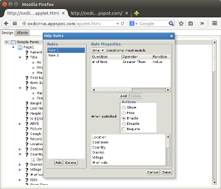

# OXD Form Designer Prototype

This is just an example showing how one might implement a graphical form
designer for OpenXData using Apache Pivot. It is not meant to be an actual
product, but a demonstration.   

For a working demonstration of the designer, please see the [OXD Cirrus
project](https://github.com/batkinson/OXDCirrus).
